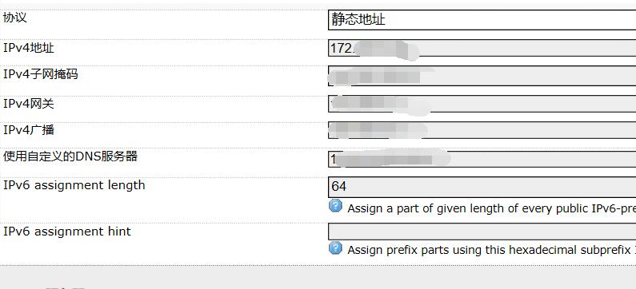
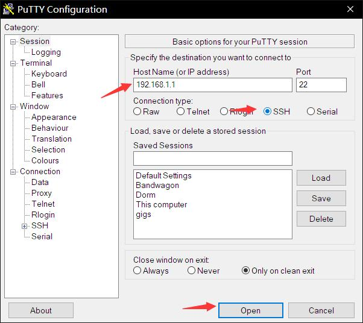
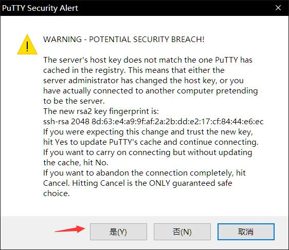
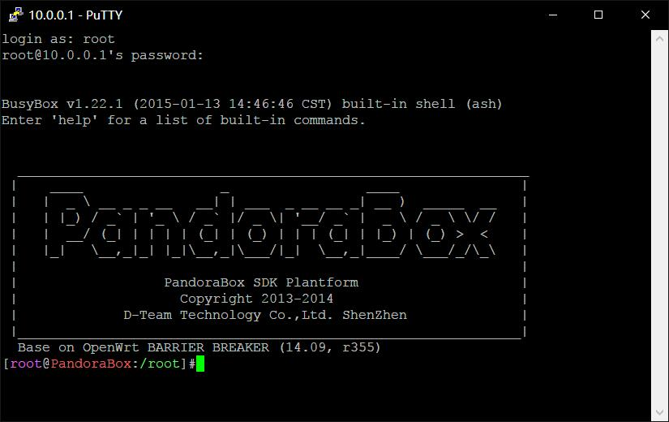

### 使用说明
---
本教程为重庆大学Dr.com路由器分网教程，文中所用第三方客户端源于[drcom-generic](https://github.com/drcoms/drcom-generic)。仅在重大A区测试通过，其他校区的同学可能需要使用[d版简略使用和配置说明](https://github.com/drcoms/drcom-generic/wiki/d%E7%89%88%E7%AE%80%E7%95%A5%E4%BD%BF%E7%94%A8%E5%92%8C%E9%85%8D%E7%BD%AE%E8%AF%B4%E6%98%8E)中所示方法自行抓包生成客户端。废话不多说以下开始正文。~~使用*nix的同学请无视此文，dalao们不必在此浪费时间。~~

本文所需软硬件如下：
> 路由器: MT7620A

> 固件： [OpenWrt 14.09](./MT7620A.bin)

> 客户端：[Drcom.py](./Drcom.py)

> 脑子：请带上脑子阅读本文

### 准备工作
#### 路由器选择
原则上来讲只要是支持OpenWrt的路由器都可以使用Python版客户端分网。本人仅测试过MT7620A和HG255D，淘宝上这两款路由器价格很便宜，超过60块钱的店就属于黑店，请各位同学擦亮双眼。

比较推荐使用MT7620A，便宜量足，更重要的是固件众多可玩性比较高，本人购买的_优酷土豆路由宝_仅45元。而且淘宝卖家一般会刷入Breed并帮忙代刷系统。
#### 路由器刷机

~~已经委托卖家带刷机的同学可以跳过。~~

请参考:  [优酷路由宝刷潘多拉固件最详细教程](http://www.right.com.cn/forum/thread-161802-1-1.html)
#### 路由器设置

~~非办公区的同学请，无视这段。~~

对于办公区，由于固定IP我们需要进行一些基本的设置才能进行接下来的工作。

连接上路由器网络之后，打开任意浏览器请访问[192.168.1.1](http://192.168.1.1)，输入密码，OpenWrt默认为`admin`。进入路由器设置页面，点击右侧`网络`->`接口`->`wan`。在右边界面设置界面,协议选择`静态地址`,点击`切换协议`，然后输入分配的网络信息，点击`保存&应用`。


#### 客户端文件修改

在真正进行路由器设置之前需要修改客户端文件[Drcom.py](./Drcom.py)加账号、密码。此处使用Windows自带记事本打开即可，需要修改的地方位于Drcom.py文件20行处，请在引号内填入相关信息。

```
# 此处添加你的账号、密码
username='YOURNAME'
password='YOURPASSWORD'
```
#### U盘准备
请准备一个已经格式化为`FAT32`或者`exFAT`的U盘，将上一步修改好的客户端文件拷贝到U盘根目录中备用。

### 路由器上的设置
#### 连接路由器
由于Windows并没有终端，我们需要使用[putty](./putty.exe)来ssh连接路由器。对于使用Windows 10的同学鄙人墙裂推荐安装Windows 10自带的Linux子系统，参考：[Windows 10 Linux子系统 （wsl）学习手记](http://www.jianshu.com/p/d1b9ca63adf3)。

输入，路由器的地址`192.168.1.1`，先择`SSH`，点击`OPEN`即可连接路由器。



接下来会弹出一个警告窗口，选择`是`即可。



在putty终端中输入用户名`root`回车，并输入密码`admin`回车（_这里输入密码光标并不会移动_），即可成功连接路由器。


#### Python安装
在putyy终端中输入`Python`回车，如果得到下图所示的提示。恭喜你，你的固件中已经带有python，本节可略过，按`Ctrl + D`退出Python交互模式进行接下来的操作即可。


很遗憾这里我们需要自行安装Python，由于现在路由器并不能连上网这件事似乎还有一些麻烦。这里我们需要手动下载[ipk文件](./packages)。

<span id="d1"></span>
U盘根目录中新建文件夹`packages`,将本步下载的所有文件放入此目录，然后将U盘插入路由器。稍等片刻后，在putty终端中输入`df`回车，可以看到我们的U盘被挂载到了`/mnt/sda4`目录。（容量最大的就是U盘君。）


在终端中输入`cd /mnt/sda4/packages`，进入刚才下载的ipk文件目录，然后在终端中输入`opkg install ./*.ipk`,冲上一杯咖啡等待python安装完成。

#### 客户端配置
没有将U盘插入路由器的同学请将U盘插入路由器，参考[上一步中的方法](#d1),在终端中输入`/mnt/sda4`回车，进入U盘根目录。

首先，我们需要将客户端文件`Drcom.py`拷贝到路由器中。在终端中输入`cp ./Drcom.py /root/`回车，我们就将客户端拷贝到了路由器中。

然后，我们需要将客户端添加到启动项中。在中断中输入`vim /etc/rc.local`回车，我们启动`VIM`修改此文件。我们按下`i`键进入编辑模式，通过方向键移动光标，在`exit 0`之前添加`/usr/bin/python /root/Drcom.py`；接着我们需要按下`Esc`键，进入一般模式，输入`:wq`退出并保存。至此我们的路由器在重启后已经可以连接上校园网了。如果没有更多要求的同学可以至此为止了。

#### 断线自动重连
也许你和我一样觉得校园网断线之后手动重启路由器是一件很麻烦的事，那么我们可以配置一个脚本来设置断线自动重连。

SSH连接上路由器之后，我们在`/root/`目录下新建一个文件`reconn.sh`

`# vim reconn.sh`

在文件中输入以下内容：~~（请dalao们不要喷我正则表达式写的稀烂）~~

```
#!/bin/sh
l=0
t=$(ping -c 2 114.114.114.119 -W 3 | grep -c seq)
if [ $t -eq $l ]
then
    echo "Network is broken. Routter is trying to reconnect."
    pid_num=$(ps | grep 'Drcom.py' | sed 's/.root.*//g' | sed 's/ //g')
    if [ ! $pid_num ]
    then
        echo "Start Drcom now..."
        /root/Drcom.py
    else
        kill $pid_num
        echo "Restart Drcom now..."
        /root/Drcom.py
    fi
else
    echo "Network is OK."
fi
```

`:wq`保存后，我们需要给脚本文件`reconn.py`添加运行权限。

`# chmod +x reconn.py`

最后我们在`crontab`中添加服务。

`# crontab -e`

在文件中添加:

```
*/2 * * * * /root/reconn.sh
```
`:wq`保存后，路由器就会每2分钟检查一次网络，如果断线将会自动重连。

### 附录

#### MT7620A OpenWrt 14.09源
```
src/gz r2_base http://downloads.openwrt.org.cn/PandoraBox/ralink/packages/base
src/gz r2_management http://downloads.openwrt.org.cn/PandoraBox/ralink/packages/management
src/gz r2_oldpackages http://downloads.openwrt.org.cn/PandoraBox/ralink/packages/oldpackages
src/gz r2_packages http://downloads.openwrt.org.cn/PandoraBox/ralink/packages/packages
src/gz r2_routing http://downloads.openwrt.org.cn/PandoraBox/ralink/packages/routing
src/gz r2_telephony http://downloads.openwrt.org.cn/PandoraBox/ralink/packages/telephony
```
